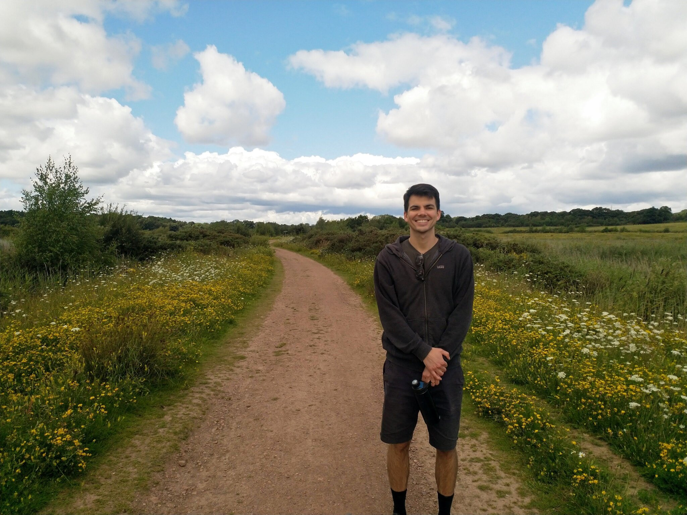

+++
title = "About Me"
description = "To a collection of my thoughts, tips & tricks"

[extra]
header = {title = "About Me", img = "#", img_alt = "" }

+++

Fortunately, 2020-21 led to the unforeseen benefit of having some free time,
so I decided to put together a simple website with no tracking or ads that
I can use as a blogging platform to share my thoughts on things from time to time.
If you would like to do the same, please reach out and I can show you how.

It costs me around £5 a month to have my own domain, site, and email address
(not managing that on my own).
Stop being a taker on the internet and create your own page to push back
against all the massive companies leading us to the same ten websites!

### Secure Contact

If you need to send me something secure you can
send it to the email in my social links and
encrypt with [`age`](https://github.com/FiloSottile/age):

- Public Key: `age15j9sttxjv5a23xkl84h8dyjp9e9cpzjxp55zqx0mtj6yn5aj7g4qldx95x`

If you want me to send you something and know it's from me, I'll sign it with
[`minisign`](https://github.com/jedisct1/minisign) and you can verify it's from
me yourself 🙂.

- Public Key: [RWS1F90616RrbJIhgUGPKi/UZ5tJOACIKCV7IK/TM4MqfBijOslM4Bcf](../minisign.pub)
