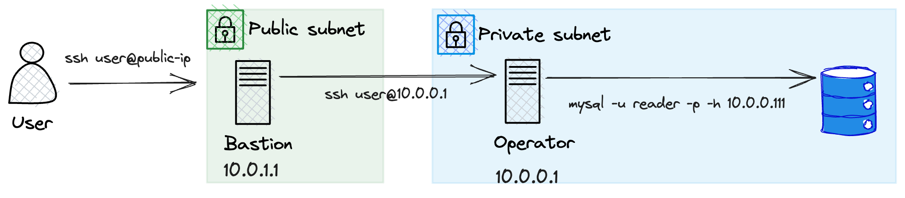
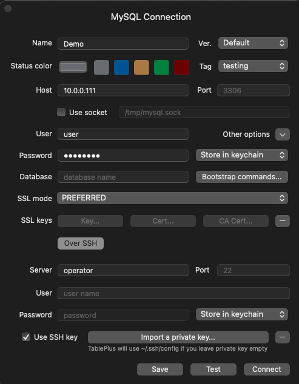

+++
title = "Connecting to Internal VPC Through Bastion in One Hop"
date = 2023-10-19

[taxonomies]
tags = ["ssh", "git"]
categories = ["programming"]
+++

If you've ever wanted to load up your local database IDE to view
a database that sits inside an internal VPC. You may be a bit puzzled
on how to do it considering most tools like DBeaver, DataGrip, TablePlus
allow you to connect via SSH, but that SSH connection is always to a
bastion instance. How does one connect directly?

<!-- more -->

## The Conundrum

To illustrate the problem, this is how the connection would
work if you were to do this manually using the mysql client
from within the VPC.



1. Connect to the bastion
2. Hop to the operator
3. Connect to the MySQL database

### The Solution

In your `~/.ssh/config` you can add a **ProxyCommand**
entry to an additional host that specifies how you will hop
through the network in order to land directly where you would like
to. In the test below, you can see that we tunnel through the bastion
to the operator directly.

```
Host bastion
    HostName <PUBLIC_IP_ADDRESS>
    ForwardAgent yes
    User user
    IdentityFile ~/.ssh/id_ed25519

Host operator
    HostName 10.0.0.1
    ForwardAgent yes
    User user
    ProxyCommand ssh -W %h:%p bastion
```

This means that if you run `ssh operator` you will land in the internal VPC!
Which is where that pesky IP address for the MySQL database is reachable.

This means that in your SQL Client, you can then configure it like so:




And it will tunnel through directly to your database from your own machine.

