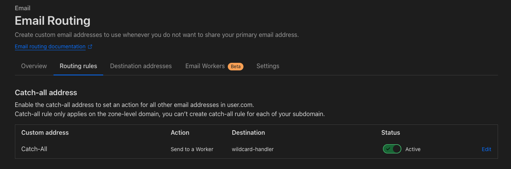

+++
title = "Wildcard Routing with Cloudflare Email Forwarding"
date = 2024-11-12

[taxonomies]
tags = []
categories = ["cloudflare", "email"]
+++

If you have your own domain name but are cheap like me and don't want to pay
for a third party service you can use Cloudflare to route your
    [emails](https://developers.cloudflare.com/email-routing/) to your gmail
    address. (And after reading this quick post, can forward even plus suffixed
    email addresses to your gmail account.

<!-- more -->

## The Explanation

What this doesn't let you do without workers, is use your `+` suffixed
addresses as you need to hard-code the recipient (such as test@test.com). You
are unable to forward `test+marketing-company@test.com` to
`actual@gmail.com`.




1. Create a new email worker
2. Give it a name and use the code below and fill in as required.
3. Enable catch-all email address
4. Send the emails to the catch-all to that worker
5. Let the worker filter those emails to your inbox if it matches
   the + suffixed email address you wish to use it for.

## The Code

```js
export default {
    async email(message, env, ctx) {
        const PREFIX = '';
        const SUFFIX = '';
        const FORWARD_EMAIL = '';
        const FORWARD_DOMAIN = '';

        if (message.to.startsWith(PREFIX) && message.to.endsWith(SUFFIX)) {
            await message.forward(`${FORWARD_EMAIL}${FORWARD_DOMAIN}`);
        } else {
            message.setReject("Unknown address");
        }
    }
}
```

