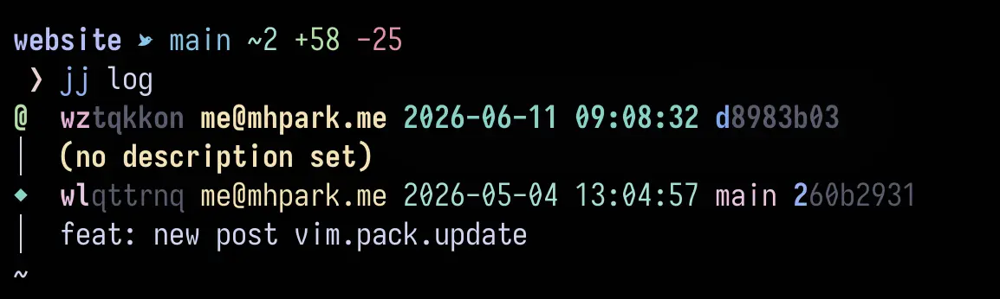

+++
title = "Starship JJ Theme"
date = 2026-06-11

[taxonomies]
tags = []
categories = ["jj", "starship"]
+++

There are a few nice modules for JJ that exist currently for [starship.rs](starship.rs) but none of them fit what I was after...

<!-- more -->

If you're like me, all that I really care about seeing in my terminal as
it relates to JJ is the nearest bookmark to my current change and whether
my current change has any files or lines added, modified, or removed.

With the snippet below, this is what the theme looks like after I've made
changes. I am one commit ahead of my current bookmark.




```toml
[custom.jj_bookmark]
detect_folders = ["this_folder_does_not_exist_forcing_always_run"]
# detect_folders = [".jj"]
when = "true"
command = '''
if jj root >/dev/null 2>&1; then
    # 1. Get the closest bookmark
    bookmark=$(jj log -r "closest_bookmark(@)" --no-graph -T 'bookmarks' --ignore-working-copy --quiet | tr -d '\n')

    # 2. Get the diff stats with colorized outputs
    stats=$(jj diff --stat --ignore-working-copy --quiet | tail -n 1 | awk -F', ' '{
        f = ($1 ~ /[0-9]+/) ? $1 : "0"; gsub(/[^0-9]/, "", f);
        i = ($2 ~ /[0-9]+/) ? $2 : "0"; gsub(/[^0-9]/, "", i);
        d = ($3 ~ /[0-9]+/) ? $3 : "0"; gsub(/[^0-9]/, "", d);

        # ANSI color codes
        cyan = "\033[36m"; green = "\033[32m"; red = "\033[31m"; reset = "\033[0m";

        if (f > 0) {
            printf "%s~%s%s %s+%s%s %s-%s%s", cyan, f, reset, green, i, reset, red, d, reset
        }
    }')

    # 3. Output them together safely
    if [ -n "$stats" ]; then
        echo -e "$bookmark $stats"
    else
        echo -e "$bookmark"
    fi
fi
'''
format = "([󱗆 $output]($style)) "
style = "sapphire"
```

> if the format doesn't render, it's a nerd-font bird icon
